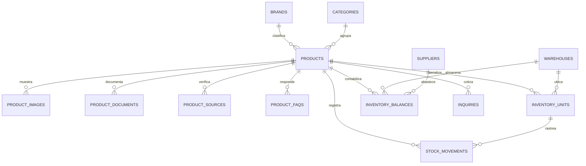

# Modelo de base de datos — inventario Alfil

El catálogo conserva todas las categorías. Un producto se publica cuando está
activo, su `available_stock` es mayor que cero y tanto su marca como su
categoría están activas.

## Tablas principales

- `products`: ficha comercial, número de parte, tipo de control, condición y
  total disponible publicado.
- `product_images`: orden y texto alternativo de las imágenes. La columna
  `url` admite rutas existentes y rutas privadas `minio://...`.
- `product_documents`: fichas técnicas, manuales, garantías y brochures PDF;
  conserva título, tipo, nombre original, tamaño, orden y ruta privada en MinIO.
- `product_sources`: página, soporte, PDF o imagen oficial usada para verificar
  cada producto; conserva URL, alcance de coincidencia y fecha de revisión.
- `product_faqs`: preguntas y respuestas técnicas específicas por producto,
  ordenadas para su presentación en la ficha pública.
- `inventory_units`: una fila por número de serie. Se usa para laptops,
  monitores, desktops, switches, UPS y otros equipos serializados.
- `inventory_balances`: saldo por producto, sede y condición. Se usa para
  tóners, accesorios y para el resumen de la importación inicial.
- `stock_movements`: historial de entradas, salidas, traslados, ventas,
  alquileres y ajustes; no debe editarse retroactivamente.
- `warehouses`: San Luis, San Borja y Callao.
- `suppliers`: Ingram, Nexsys, Deltron, HDST y otros proveedores.
- `categories`: se conservan las ocho categorías actuales aunque no tengan
  productos disponibles.

## Estados recomendados

- Unidad: `available`, `reserved`, `assigned`, `rented`, `sold`, `review`,
  `damaged`.
- Movimiento: `entry`, `exit`, `transfer`, `sale`, `rental`, `return`,
  `adjustment`, `initial_import`.
- Condición: `new`, `used`, `refurbished`.

`available_stock` es un resumen para consultas rápidas de la tienda. Debe
actualizarse dentro de la misma transacción que modifique unidades, saldos o
movimientos.
